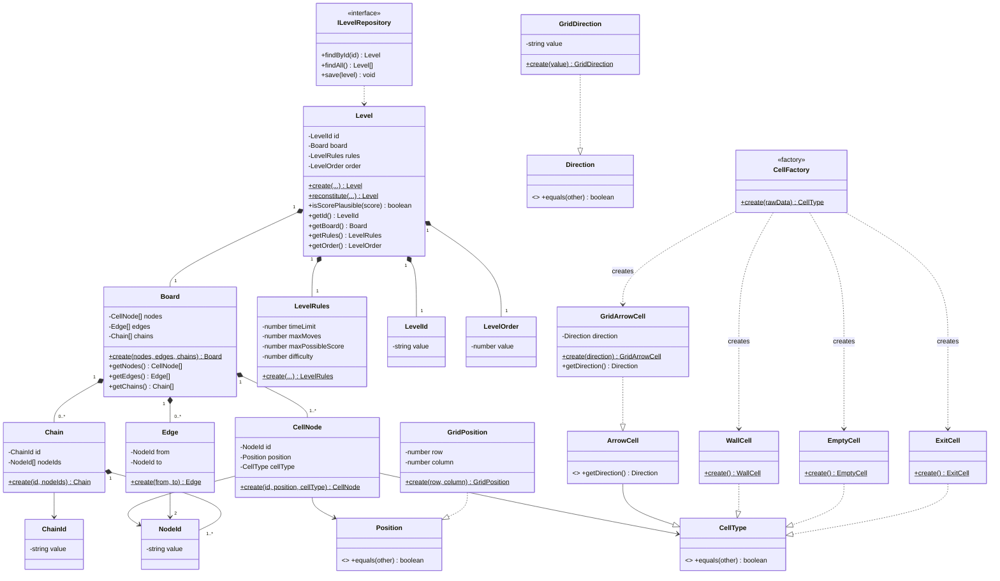
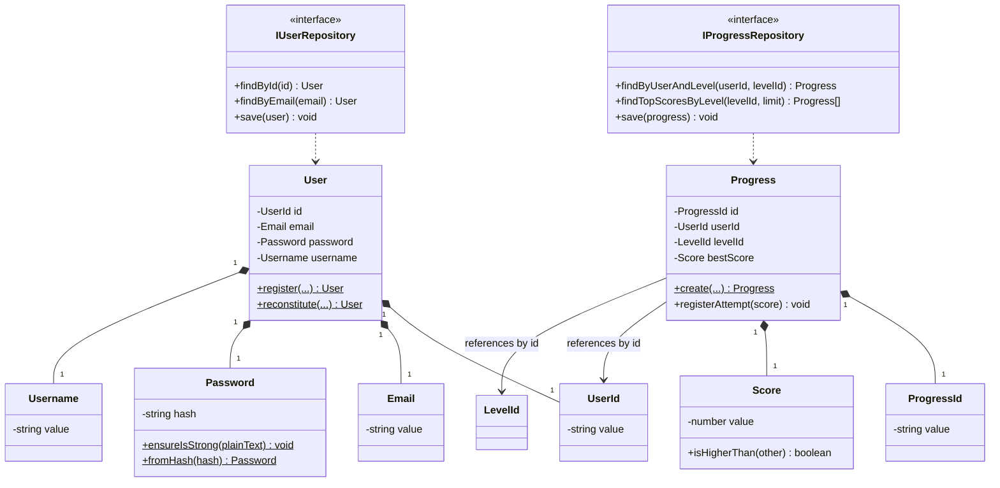

# Arrow Maze — Backend

Backend de **Arrow Maze — Escape Puzzle**: NestJS + TypeScript + PostgreSQL, implementado con
Clean Architecture (4 capas), DDD táctico, CQS y AOP vía Decorator.

> El backend **no contiene lógica de juego**. Solo crea, valida estructuralmente y sirve niveles,
> usuarios, progreso y leaderboard. Movimiento, rotación, colisión y puntuación viven en el
> cliente (repositorio hermano).

## Tech Stack

| Área | Decisión |
| --- | --- |
| Framework | NestJS |
| Lenguaje | TypeScript (`strict: true`) |
| Base de datos | PostgreSQL + TypeORM |
| Auth | Passport + JWT (`@nestjs/jwt`) |
| Hashing | bcryptjs |
| Docs | Swagger / OpenAPI (`@nestjs/swagger`) |
| Testing | Jest + Supertest + `sql.js` (SQLite en memoria para integración) |

## Setup

```bash
npm install
npm run start:dev      # desarrollo con watch
npm run build           # compila a dist/
npm run start:prod      # corre dist/main.js
npm run typecheck        # tsc --noEmit
npm test                 # unit + integración + contrato
```

## Arquitectura — Clean Architecture (4 capas)

```
Frameworks / Infrastructure → Interface Adapters → Application (Use Cases) → Domain
```

- **Domain** no importa nada de las capas externas.
- **Application** importa solo clases de dominio e interfaces de puerto.
- **Interface Adapters** implementa los puertos y traduce entre capas (DTOs ↔ dominio ↔ entidades ORM).
- **Infrastructure** cablea todo: el Composition Root **es** el sistema de módulos de NestJS
  (`src/infrastructure/modules/`), inicializado una sola vez desde `src/main.ts`.

### Agregados de dominio

- **`User`** (root) — `UserId`, `Email`, `Password`, `Username`. Puerto: `IUserRepository`.
- **`Level`** (root) — `Board`, `LevelRules`, `LevelOrder`, `LevelId`. Puerto: `ILevelRepository`.
  - `Board` es un **grafo**, no una matriz: `CellNode[]` + `Edge[]` + `Chain[]`.
  - `CellType` es polimórfico: `GridArrowCell` (implementa `ArrowCell extends CellType`),
    `WallCell`, `EmptyCell`, `ExitCell`.
- **`Progress`** (root) — referencia `UserId`/`LevelId` **por id**, nunca por objeto.
  Puerto: `IProgressRepository`.

### CQS (Command-Query Separation)

Cada caso de uso implementa exactamente uno de estos dos puertos de método único:

```ts
interface ICommandService<TCommand> { execute(command: TCommand): Promise<void> }
interface IQueryService<TQuery, TResult> { execute(query: TQuery): Promise<TResult> }
```

### AOP vía Decorator

En vez de una librería de AOP, los *cross-cutting concerns* (logging, autenticación) son
decoradores que envuelven el mismo puerto CQS que el caso de uso real:

```
SecureXDecorator( LoggingXDecorator( UseCaseReal ) )
```

## Diagrama de clases

> Generado a partir del código fuente real (`src/`), no de una plantilla genérica.
> Renderiza en GitHub/GitLab de forma nativa (Mermaid).

### Domain — `Level` (agregado principal)



### Domain — `User` y `Progress`



### Application — CQS + Use Cases

```mermaid
classDiagram
    class ICommandService~TCommand~ {
        <<interface>>
        +execute(command) Promise~void~
    }
    class IQueryService~TQuery,TResult~ {
        <<interface>>
        +execute(query) Promise~TResult~
    }

    class CreateLevelUseCase { +execute(CreateLevelCommand) Promise~void~ }
    class RegisterUserUseCase { +execute(RegisterUserCommand) Promise~void~ }
    class SyncProgressUseCase { +execute(SyncProgressCommand) Promise~void~ }
    class GetLevelsUseCase { +execute(GetLevelsQuery) Promise~Level[]~ }
    class GetLeaderboardUseCase { +execute(GetLeaderboardQuery) Promise~LeaderboardEntryResult[]~ }
    class LoginUseCase { +execute(LoginQuery) Promise~LoginResult~ }

    CreateLevelUseCase ..|> ICommandService~CreateLevelCommand~
    RegisterUserUseCase ..|> ICommandService~RegisterUserCommand~
    SyncProgressUseCase ..|> ICommandService~SyncProgressCommand~
    GetLevelsUseCase ..|> IQueryService~GetLevelsQuery,Level[]~
    GetLeaderboardUseCase ..|> IQueryService~GetLeaderboardQuery,LeaderboardEntryResult[]~
    LoginUseCase ..|> IQueryService~LoginQuery,LoginResult~

    CreateLevelUseCase --> ILevelRepository
    CreateLevelUseCase --> IIdGenerator
    RegisterUserUseCase --> IUserRepository
    RegisterUserUseCase --> IIdGenerator
    RegisterUserUseCase --> IPasswordHasher
    SyncProgressUseCase --> ILevelRepository
    SyncProgressUseCase --> IProgressRepository
    SyncProgressUseCase --> IIdGenerator
    GetLevelsUseCase --> ILevelRepository
    GetLeaderboardUseCase --> IProgressRepository
    GetLeaderboardUseCase --> IUserRepository
    LoginUseCase --> IUserRepository
    LoginUseCase --> IPasswordHasher
    LoginUseCase --> ITokenGenerator

    class IIdGenerator { <<interface>> +generate() string }
    class IPasswordHasher {
        <<interface>>
        +hash(plainText) Promise~string~
        +verify(plainText, hash) Promise~boolean~
    }
    class ITokenGenerator {
        <<interface>>
        +generate(userId) string
        +verify(token) ITokenPayload
    }
    class ILogger { <<interface>> +log(message) void }
    class ITimeProvider { <<interface>> +now() Date }
```



### Interface Adapters — AOP (Decorator) y Repositorios

```mermaid
classDiagram
    class ICommandService~T~ { <<interface>> }
    class IQueryService~T,R~ { <<interface>> }

    class LoggingCommandDecorator~T~ {
        -ICommandService~T~ decoratee
        -ILogger logger
        -ITimeProvider timeProvider
        +execute(command) Promise~void~
    }
    class LoggingQueryDecorator~T,R~ {
        -IQueryService~T,R~ decoratee
        +execute(query) Promise~R~
    }
    class SecureCommandDecorator~T~ {
        -ICommandService~T~ decoratee
        -CurrentUserProvider currentUser
        +execute(command) Promise~void~
    }
    class SecureQueryDecorator~T,R~ {
        -IQueryService~T,R~ decoratee
        -CurrentUserProvider currentUser
        +execute(query) Promise~R~
    }
    class CurrentUserProvider {
        -ITokenGenerator tokenGenerator
        -string token
        +ensureAuthenticated() void
        +getUserId() string
    }

    LoggingCommandDecorator ..|> ICommandService~T~
    LoggingCommandDecorator o-- ICommandService~T~ : decoratee
    LoggingQueryDecorator ..|> IQueryService~T,R~
    LoggingQueryDecorator o-- IQueryService~T,R~ : decoratee
    SecureCommandDecorator ..|> ICommandService~T~
    SecureCommandDecorator o-- ICommandService~T~ : decoratee
    SecureCommandDecorator --> CurrentUserProvider
    SecureQueryDecorator ..|> IQueryService~T,R~
    SecureQueryDecorator o-- IQueryService~T,R~ : decoratee
    SecureQueryDecorator --> CurrentUserProvider

    class TypeOrmUserRepository { +findById(id) User +findByEmail(email) User +save(user) void }
    class TypeOrmLevelRepository { +findById(id) Level +findAll() Level[] +save(level) void }
    class TypeOrmProgressRepository { +findByUserAndLevel(...) Progress +findTopScoresByLevel(...) Progress[] +save(p) void }
    class UserMapper { +toDomain(entity)$ User +toEntity(user)$ UserEntity }
    class LevelMapper { +toDomain(entity)$ Level +toEntity(level)$ LevelEntity }
    class ProgressMapper { +toDomain(entity)$ Progress +toEntity(p)$ ProgressEntity }
    class BoardMapper { +toDomain(nodes, edges, chains)$ Board +toRaw(board)$ }

    TypeOrmUserRepository ..|> IUserRepository
    TypeOrmUserRepository --> UserMapper
    TypeOrmLevelRepository ..|> ILevelRepository
    TypeOrmLevelRepository --> LevelMapper
    TypeOrmProgressRepository ..|> IProgressRepository
    TypeOrmProgressRepository --> ProgressMapper
    LevelMapper ..> BoardMapper
    BoardMapper ..> CellFactory

    class AuthController { +register(dto) Promise~void~ +login(dto) TokenDTO }
    class LevelController { +getLevels(authHeader) LevelDTO[] +createLevel(dto, authHeader) Promise~void~ }
    class ProgressController { +sync(dto, authHeader) Promise~void~ }
    class LeaderboardController { +getLeaderboard(levelId, authHeader) LeaderboardEntryDTO[] }
    class DomainExceptionFilter { +catch(error, host) void }

    AuthController --> ICommandService~T~
    AuthController --> IQueryService~T,R~
    LevelController --> CurrentUserProvider
    ProgressController --> CurrentUserProvider
    LeaderboardController --> CurrentUserProvider
```



## Reglas de dominio (invariantes)

- `Board` valida: nodos no vacíos, **al menos una `ExitCell`**, edges referencian `NodeId`s
  válidos, cada `Chain` referencia nodos existentes, sin duplicados, con cabeza `grid_arrow`
  y cuerpo `empty`.
- `Progress.registerAttempt(score)` — `bestScore` es **monótono**: solo se actualiza si el
  nuevo puntaje es mayor.
- `Level.isScorePlausible(score)` — rechaza puntajes que excedan `maxPossibleScore`.
- El backend **no interpreta** `row`/`column` ni `direction`: son datos para el cliente.

## API Endpoints

| Método | Path | Auth | Caso de uso |
| --- | --- | --- | --- |
| POST | `/auth/register` | público | `RegisterUserUseCase` |
| POST | `/auth/login` | público | `LoginUseCase` |
| GET | `/levels` | JWT | `GetLevelsUseCase` |
| POST | `/levels` | JWT | `CreateLevelUseCase` |
| POST | `/progress/sync` | JWT | `SyncProgressUseCase` |
| GET | `/leaderboard/:levelId` | JWT | `GetLeaderboardUseCase` |

## Estructura de carpetas

```
src/
├─ domain/                # Capa 1 — sin dependencias externas
│  ├─ user/                # User, VOs, IUserRepository
│  ├─ level/                # Level, Board, CellNode, Edge, Chain, CellType*, ILevelRepository
│  └─ progress/             # Progress, Score, IProgressRepository
├─ application/            # Capa 2 — CQS
│  ├─ ports/                 # ICommandService, IQueryService, IIdGenerator, ILogger, ...
│  ├─ commands/ queries/ results/
│  └─ use-cases/
├─ interface-adapters/     # Capa 3
│  ├─ controllers/           # Auth, Level, Progress, Leaderboard + DomainExceptionFilter
│  ├─ decorators/             # AOP: Logging*, Secure*, CurrentUserProvider
│  ├─ repositories/           # TypeOrm*Repository
│  ├─ entities/                # UserEntity, LevelEntity, ProgressEntity (TypeORM)
│  ├─ mappers/                 # domain <-> entity/raw DTO
│  └─ dtos/                    # input / output
└─ infrastructure/         # Capa 4 — Composition Root (NestJS Modules)
   ├─ modules/                 # AppModule + un módulo por feature
   ├─ auth/ shared/             # implementaciones concretas de los puertos técnicos
   └─ tokens.ts                 # símbolos de inyección de dependencias
```

## Testing

Arquitectura de tests de 3 niveles (Object Mother → Testing API → `it` block). Ver `CLAUDE.md`
para la convención completa. Suites: unit (dominio + casos de uso), integración (HTTP +
`sql.js` en memoria), contrato.

```bash
npm test
```

## Conventional Commits

```
feat(auth): add JWT authentication
fix(level): validate exactly one exit cell in board
test(progress): add unit tests for registerAttempt invariant
refactor(domain): extract CellFactory to domain layer
```
