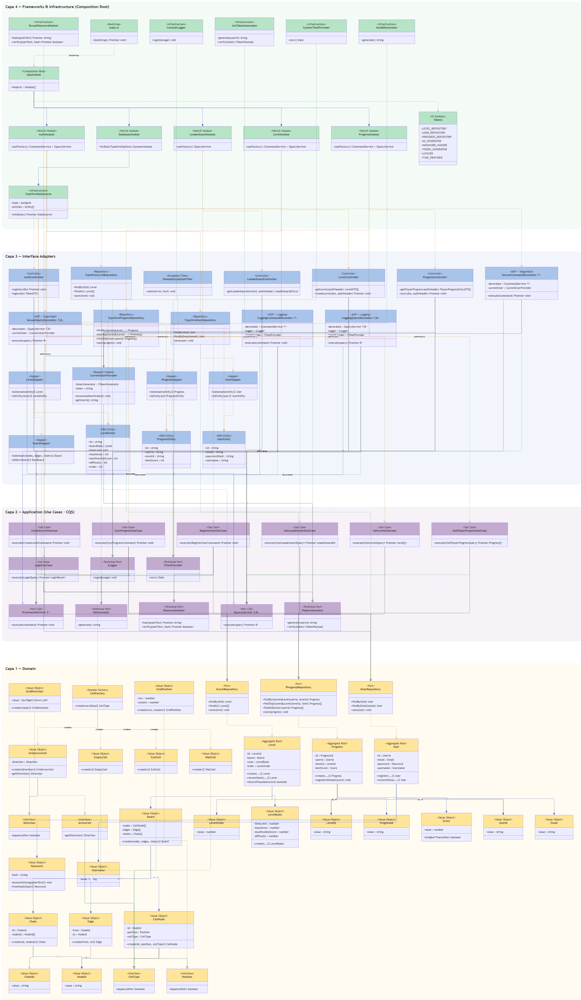
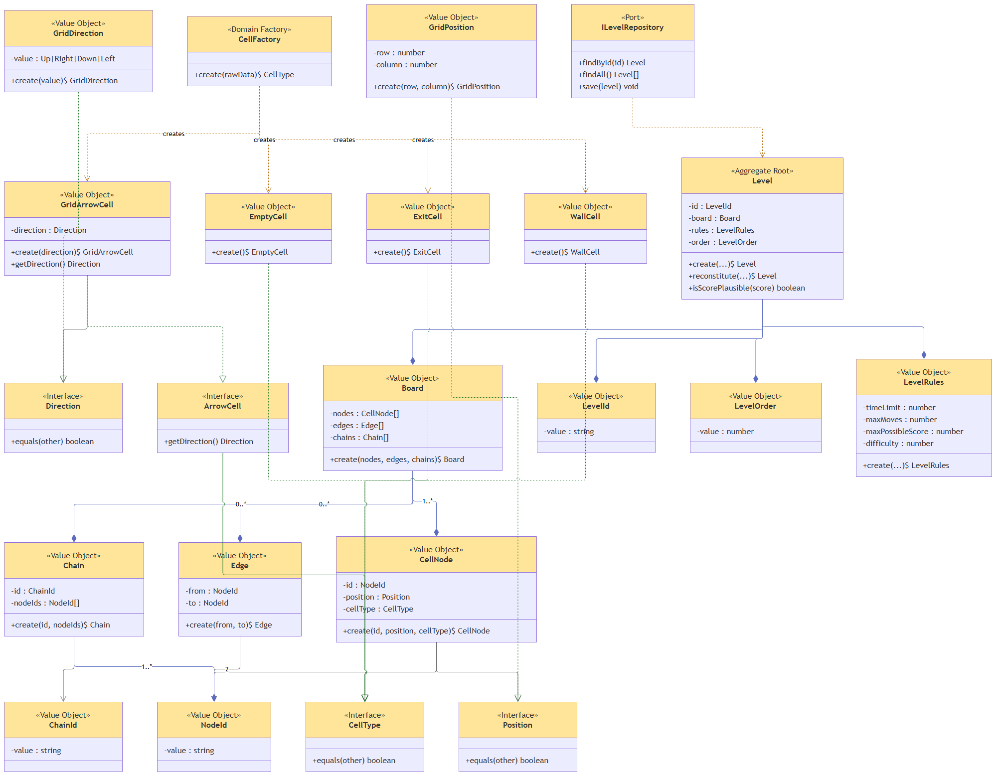
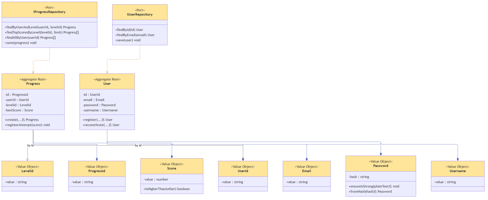
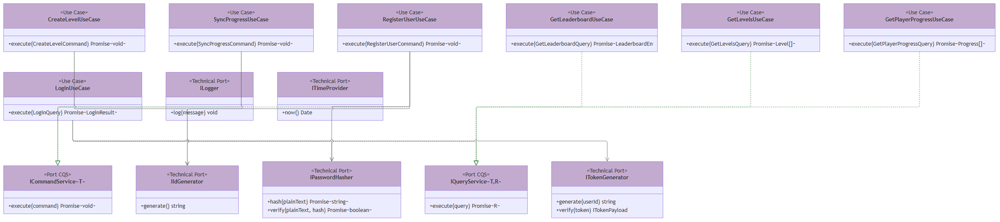
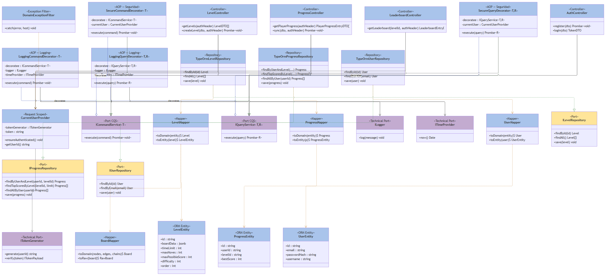
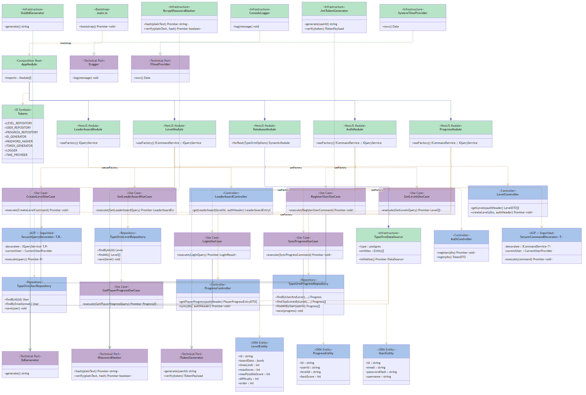

# Arrow Maze — Backend

Backend de **Arrow Maze — Escape Puzzle**: NestJS + TypeScript + PostgreSQL, implementado con
Clean Architecture (4 capas), DDD táctico, CQS y AOP vía Decorator.

> El backend **no contiene lógica de juego**. Solo crea, valida estructuralmente y sirve niveles,
> usuarios, progreso y leaderboard. Movimiento, rotación, colisión y puntuación viven en el
> cliente (repositorio hermano).

## Tech Stack

| Área | Decisión |
| --- | --- |
| Framework | NestJS |
| Lenguaje | TypeScript (`strict: true`) |
| Base de datos | PostgreSQL + TypeORM |
| Auth | Passport + JWT (`@nestjs/jwt`) |
| Hashing | bcryptjs |
| Docs | Swagger / OpenAPI (`@nestjs/swagger`) |
| Testing | Jest + Supertest + `sql.js` (SQLite en memoria para integración) |

## Setup

```bash
npm install
npm run start:dev      # desarrollo con watch
npm run build           # compila a dist/
npm run start:prod      # corre dist/main.js
npm run typecheck        # tsc --noEmit
npm test                 # unit + integración + contrato
```

## Diagrama de arquitectura

Fuente editable: [`docs/DiagramaBackendCleanArchitecture_v2_drawio.xml`](docs/DiagramaBackendCleanArchitecture_v2_drawio.xml)
(abrir con [draw.io / diagrams.net](https://app.diagrams.net/)). Las imágenes de abajo son
renders exportados de ese mismo archivo, embebidos para que se vean directo en el README.

### Vista completa — 4 capas



### Capa 1 — Domain · `Level`



### Capa 1 — Domain · `User` & `Progress`



### Capa 2 — Application (CQS + Use Cases)



### Capa 3 — Interface Adapters (AOP · Repos · Controllers)



### Capa 4 — Infrastructure (Composition Root)



## Principios SOLID

Los 5 principios están aplicados en el código, no solo mencionados. Abajo, un ejemplo concreto
por principio, tomado del proyecto (no un ejemplo genérico de libro). La aplicación de SOLID
específica a los decoradores AOP se detalla más abajo, en [Cómo esto aplica SOLID](#cómo-esto-aplica-solid) —
esta sección cubre el resto del código: dominio, casos de uso y repositorios.

### S — Single Responsibility Principle

Cada clase cambia por una única razón. En el flujo de sincronizar progreso, tres clases separan
tres responsabilidades distintas: **el caso de uso orquesta**, **el agregado protege su propio
invariante**, y **el repositorio solo persiste** — ninguna sabe cómo hacer el trabajo de la otra.

```ts
// src/domain/progress/progress.aggregate.ts — SOLO protege el invariante bestScore
registerAttempt(score: Score): void {
  if (score.isHigherThan(this.bestScore)) {
    this.bestScore = score;
  }
}
```

```ts
// src/application/use-cases/sync-progress.use-case.ts — SOLO orquesta, no valida internals de Progress
async execute(command: SyncProgressCommand): Promise<void> {
  const level = await this.levelRepository.findById(levelId);
  if (!level) throw new LevelNotFoundError(/* ... */);
  if (!level.isScorePlausible(command.score)) throw new ImplausibleScoreError(/* ... */);

  const existingProgress = await this.progressRepository.findByUserAndLevel(userId, levelId);
  if (existingProgress) {
    existingProgress.registerAttempt(score); // delega el invariante al agregado
    await this.progressRepository.save(existingProgress);
    return;
  }
  // ... crear Progress nuevo si no existía
}
```

Si mañana cambia **cómo** se decide un mejor puntaje, se toca `Progress.registerAttempt` — nunca
el caso de uso. Si cambia **de dónde** viene el nivel (otra DB, otra API), se toca
`ILevelRepository`/su implementación — nunca el agregado.

### O — Open/Closed Principle

`CellType` es una interfaz mínima (`equals()`); cada tipo de celda es una clase separada que la
implementa. Agregar un tipo de celda nuevo (ej. un power-up futuro) es **agregar una clase +
un `case` en el factory** — cero cambios en `WallCell`, `EmptyCell`, `ExitCell` ni en el código
que ya consume `CellType`.

```ts
// src/domain/level/interfaces/cell-type.ts
export interface CellType {
  equals(other: CellType): boolean;
}

// src/domain/level/value-objects/wall-cell.ts — una implementación, cerrada a modificación
export class WallCell implements CellType {
  private constructor() {}
  static create(): WallCell { return new WallCell(); }
  equals(other: CellType): boolean { return other instanceof WallCell; }
}

// src/domain/level/factories/cell.factory.ts — el único punto que conoce las subclases
export class CellFactory {
  static create(rawData: CellRawData): CellType {
    switch (rawData.type) {
      case 'grid_arrow': return GridArrowCell.create(GridDirection.create(rawData.direction ?? ''));
      case 'wall': return WallCell.create();
      case 'empty': return EmptyCell.create();
      case 'exit': return ExitCell.create();
      default: throw new UnknownCellTypeError(/* ... */);
    }
  }
}
```

### L — Liskov Substitution Principle

`IUserRepository` tiene dos implementaciones intercambiables: `TypeOrmUserRepository` (producción,
habla con Postgres) e `InMemoryUserRepository` (tests, arrays en memoria). Cualquier caso de uso
que dependa de `IUserRepository` — como `RegisterUserUseCase` o `LoginUseCase` — funciona
idéntico sin importar cuál de las dos reciba, ni se entera de la diferencia.

```ts
// src/domain/user/i-user-repository.ts
export interface IUserRepository {
  findById(id: UserId): Promise<User | null>;
  findByEmail(email: Email): Promise<User | null>;
  save(user: User): Promise<void>;
}

// test/in-memory/in-memory-user.repository.ts — sustituye a TypeOrmUserRepository en tests
export class InMemoryUserRepository implements IUserRepository {
  private readonly seededUsers: User[] = [];
  private readonly savedUsers: User[] = [];

  async findById(id: UserId): Promise<User | null> {
    return this.allUsers().find((user) => user.getId().equals(id)) ?? null;
  }
  async findByEmail(email: Email): Promise<User | null> {
    return this.allUsers().find((user) => user.getEmail().equals(email)) ?? null;
  }
  async save(user: User): Promise<void> { this.savedUsers.push(user); }
  private allUsers(): User[] { return [...this.seededUsers, ...this.savedUsers]; }
}
```

Ningún `it()` de la suite de `RegisterUserUseCase` sabe que está corriendo contra un array en
memoria en vez de Postgres — esa es precisamente la garantía que da LSP.

### I — Interface Segregation Principle

`ICommandService<TCommand>` e `IQueryService<TQuery, TResult>` son interfaces de **un solo
método**. Ningún caso de uso ni decorador está forzado a implementar algo que no necesita (por
ejemplo, un método `execute` que devuelva datos cuando en realidad es un comando que solo muta).
Lo mismo aplica a los puertos de repositorio: `IUserRepository`, `ILevelRepository` e
`IProgressRepository` son interfaces separadas y chicas, una por agregado — no un
`IRepository` gigante con métodos de los tres dominios mezclados.

```ts
// src/application/ports/command-service.ts
export interface ICommandService<TCommand> {
  execute(command: TCommand): Promise<void>;
}

// src/application/ports/query-service.ts
export interface IQueryService<TQuery, TResult> {
  execute(query: TQuery): Promise<TResult>;
}
```

### D — Dependency Inversion Principle

`SyncProgressUseCase` (una clase de alto nivel, Capa 2) depende únicamente de abstracciones —
`ILevelRepository`, `IProgressRepository`, `IIdGenerator` — nunca de `TypeOrmProgressRepository`
ni de TypeORM. La implementación concreta se decide una sola vez, en el Composition Root
(`progress.module.ts`), y se inyecta desde afuera.

```ts
// src/application/use-cases/sync-progress.use-case.ts — depende de interfaces, no de TypeORM
export class SyncProgressUseCase implements ICommandService<SyncProgressCommand> {
  constructor(
    private readonly levelRepository: ILevelRepository,
    private readonly progressRepository: IProgressRepository,
    private readonly idGenerator: IIdGenerator,
  ) {}
  // ...
}
```

```ts
// src/infrastructure/modules/progress.module.ts — el Composition Root decide la implementación concreta
useFactory: (levelRepository, progressRepository, idGenerator, logger, timeProvider) =>
  (currentUser) =>
    new SecureCommandDecorator(
      new LoggingCommandDecorator(
        new SyncProgressUseCase(levelRepository, progressRepository, idGenerator),
        logger,
        timeProvider,
      ),
      currentUser,
    ),
inject: [LEVEL_REPOSITORY, PROGRESS_REPOSITORY, ID_GENERATOR, LOGGER, TIME_PROVIDER],
```

`LEVEL_REPOSITORY`/`PROGRESS_REPOSITORY` son símbolos de NestJS que en `PersistenceModule` se
bindean a `TypeOrmLevelRepository`/`TypeOrmProgressRepository` — el único lugar del proyecto que
lo sabe.

## Patrones de diseño (GoF)

Solo se listan los patrones que están **realmente implementados en el código**, verificados leyendo
el `src/` — no una lista aspiracional. Se buscó explícitamente `getInstance()`/`private static
instance` en todo el proyecto para confirmar si existía Singleton como patrón propio: **no
existe**. Que NestJS instancie sus providers como singleton es comportamiento del framework, no
algo que el equipo haya implementado — por eso no está en esta lista.

| Patrón | Categoría | Clase | Por qué |
| --- | --- | --- | --- |
| **Factory Method** | Creacional | `CellFactory.create()` | Decide qué subclase de `CellType` instanciar sin que el caller conozca las clases concretas |
| **Adapter** | Estructural | `TypeOrmUserRepository`, `TypeOrmLevelRepository`, `TypeOrmProgressRepository` | Adaptan la API de `Repository<Entity>` de TypeORM a los puertos de dominio (`I*Repository`) |
| **Decorator** | Estructural | `LoggingCommandDecorator`, `SecureCommandDecorator`, `LoggingQueryDecorator`, `SecureQueryDecorator` | Documentado en detalle más abajo, en [AOP vía Decorator](#aop-vía-decorator) |

### Factory Method — `CellFactory`

Un tipo de celda (`grid_arrow`, `wall`, `empty`, `exit`) llega como dato crudo (`type: string`) y
hay que instanciar la subclase de `CellType` correcta. El caller (`BoardMapper`, en Capa 3) nunca
importa `WallCell`/`EmptyCell`/`ExitCell`/`GridArrowCell` directamente — solo conoce `CellFactory`
y la interfaz `CellType` que devuelve.

```ts
// src/domain/level/factories/cell.factory.ts
export class CellFactory {
  static create(rawData: CellRawData): CellType {
    switch (rawData.type) {
      case 'grid_arrow':
        return GridArrowCell.create(GridDirection.create(rawData.direction ?? ''));
      case 'wall':
        return WallCell.create();
      case 'empty':
        return EmptyCell.create();
      case 'exit':
        return ExitCell.create();
      default:
        throw new UnknownCellTypeError(`"${rawData.type}" is not a known cell type.`);
    }
  }
}
```

### Adapter — `TypeOrm*Repository`

El dominio define el puerto `IUserRepository` con su propio vocabulario (`User`, `UserId`,
`Email`). TypeORM expone `Repository<UserEntity>`, con un vocabulario distinto (`findOneBy`,
entidades anotadas). `TypeOrmUserRepository` es el adaptador entre los dos: implementa el puerto
de dominio y por dentro traduce con `UserMapper` hacia/desde la API real de TypeORM.

```ts
// src/interface-adapters/repositories/typeorm-user.repository.ts
export class TypeOrmUserRepository implements IUserRepository {
  constructor(private readonly ormRepository: Repository<UserEntity>) {}

  async findById(id: UserId): Promise<User | null> {
    const entity = await this.ormRepository.findOneBy({ id: id.getValue() });
    return entity ? UserMapper.toDomain(entity) : null;
  }

  async findByEmail(email: Email): Promise<User | null> {
    const entity = await this.ormRepository.findOneBy({ email: email.getValue() });
    return entity ? UserMapper.toDomain(entity) : null;
  }

  async save(user: User): Promise<void> {
    const entity = UserMapper.toEntity(user);
    await this.ormRepository.save(entity);
  }
}
```

El caso de uso que recibe `IUserRepository` (ej. `RegisterUserUseCase`) nunca sabe que del otro
lado hay TypeORM — podría ser Mongo, un archivo JSON, o el `InMemoryUserRepository` de los tests
(ver [L — Liskov Substitution Principle](#l--liskov-substitution-principle)).

## AOP vía Decorator

**CQS (Command-Query Separation)** es la base sobre la que se apoya el AOP de este proyecto: cada
caso de uso implementa exactamente uno de estos dos puertos de método único —

```ts
interface ICommandService<TCommand> { execute(command: TCommand): Promise<void> }
interface IQueryService<TQuery, TResult> { execute(query: TQuery): Promise<TResult> }
```

En vez de una librería de AOP, los *cross-cutting concerns* (logging, autenticación) son
decoradores que envuelven el mismo puerto CQS que el caso de uso real:

```
SecureXDecorator( LoggingXDecorator( UseCaseReal ) )
```

### Los 4 decoradores

Hay un par por cada lado de CQS — uno para `ICommandService<TCommand>`, otro para
`IQueryService<TQuery, TResult>` — porque un decorador solo puede envolver el puerto que
implementa; mezclar ambos en una interfaz rompería CQS también en la capa de adapters.

| Decorador | Envuelve | Qué hace |
| --- | --- | --- |
| `LoggingCommandDecorator<TCommand>` | `ICommandService<TCommand>` | Loguea inicio/fin/duración/error vía `runWithLogging` (helper compartido) |
| `LoggingQueryDecorator<TQuery, TResult>` | `IQueryService<TQuery, TResult>` | Igual que el anterior, para el lado de lectura |
| `SecureCommandDecorator<TCommand>` | `ICommandService<TCommand>` | Llama `currentUser.ensureAuthenticated()` antes de delegar — si el JWT es inválido/expiró, lanza `UnauthorizedError` sin ejecutar el caso de uso |
| `SecureQueryDecorator<TQuery, TResult>` | `IQueryService<TQuery, TResult>` | Igual que el anterior, para queries |

```ts
// src/interface-adapters/decorators/command/secure-command.decorator.ts
export class SecureCommandDecorator<TCommand> implements ICommandService<TCommand> {
  constructor(
    private readonly decoratee: ICommandService<TCommand>,
    private readonly currentUser: CurrentUserProvider,
  ) {}

  async execute(command: TCommand): Promise<void> {
    this.currentUser.ensureAuthenticated();
    return this.decoratee.execute(command);
  }
}
```

`CurrentUserProvider` (`decorators/shared/current-user.provider.ts`) es **una instancia por
request**: envuelve el JWT crudo y memoiza el resultado de `ITokenGenerator.verify()`, para que
tanto el decorator (que solo necesita saber "¿está autenticado?") como el controller (que además
necesita `getUserId()`) decodifiquen el token una sola vez.

El wiring real (`src/infrastructure/modules/*.module.ts`) arma la cadena por `useFactory`:

```ts
// progress.module.ts
useFactory: (levelRepo, progressRepo, idGen, logger, timeProvider) =>
  (currentUser: CurrentUserProvider) =>
    new SecureCommandDecorator(
      new LoggingCommandDecorator(new SyncProgressUseCase(levelRepo, progressRepo, idGen), logger, timeProvider),
      currentUser,
    ),
```

`AuthController` es la única excepción: sus dos casos de uso (`register`, `login`) solo pasan
por `LoggingXDecorator`, sin `SecureXDecorator`, porque son los únicos endpoints públicos —
exigir un JWT para poder loguearse sería circular.

### Cómo esto aplica SOLID

- **SRP (responsabilidad única).** El caso de uso real solo conoce su regla de negocio.
  `LoggingCommandDecorator` solo sabe medir tiempo y loguear. `SecureCommandDecorator` solo sabe
  verificar sesión. Cada clase cambia por una única razón.
- **OCP (abierto/cerrado).** Agregar un aspecto nuevo (ej. caching, rate limiting) es crear un
  decorador nuevo que implemente el mismo puerto — **cero** cambios en los casos de uso existentes
  ni en los decoradores ya escritos.
- **LSP (sustitución de Liskov).** `LoggingCommandDecorator<T>`, `SecureCommandDecorator<T>` y
  `SyncProgressUseCase` son intercambiables en cualquier punto que espere un
  `ICommandService<SyncProgressCommand>` — el controller nunca sabe si está llamando al caso de
  uso real o a 2 decoradores anidados encima.
- **ISP (segregación de interfaces).** `ICommandService`/`IQueryService` son puertos de **un solo
  método** (`execute`). Un decorador no está obligado a implementar nada que no necesite.
- **DIP (inversión de dependencias).** Los decoradores dependen de la abstracción CQS
  (`ICommandService<TCommand>`), nunca de una clase concreta como `SyncProgressUseCase` —
  por eso el mismo `LoggingCommandDecorator` sirve para los 4 comandos del proyecto sin
  duplicar código.

Esto también es el **patrón GoF Decorator** en su forma clásica: cada decorador implementa la
misma interfaz que envuelve (`decoratee: ICommandService<TCommand>`) y delega en ella, agregando
comportamiento antes/después sin herencia ni modificar la clase envuelta.
